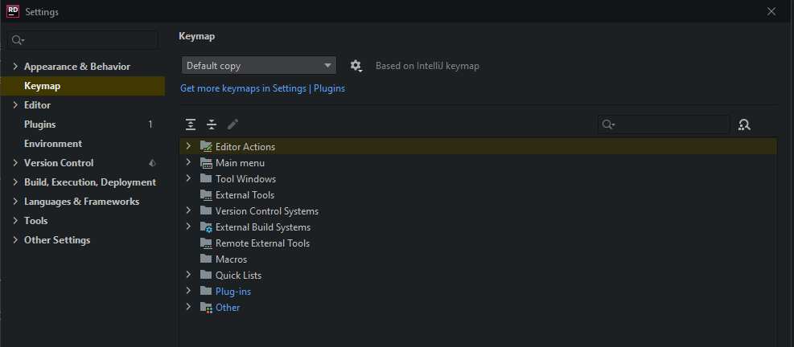
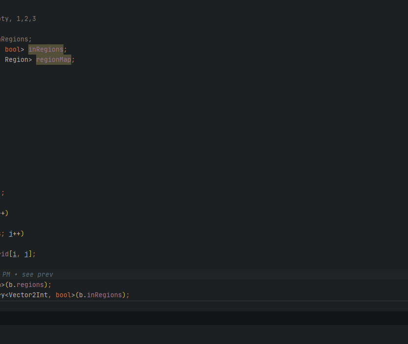
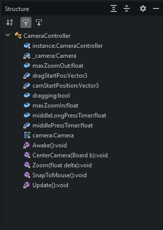
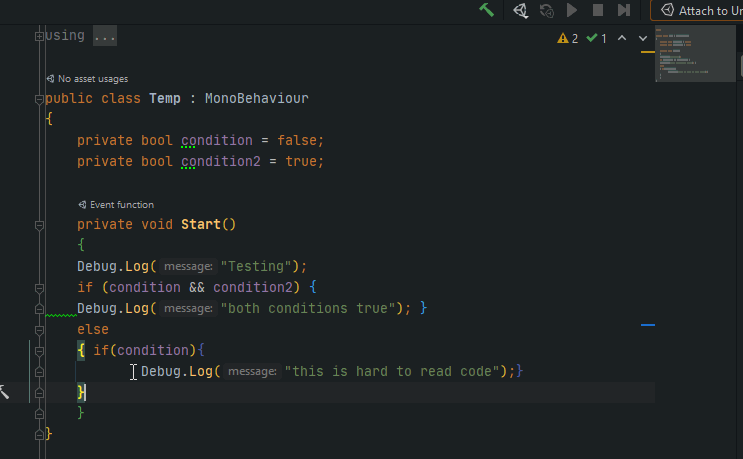
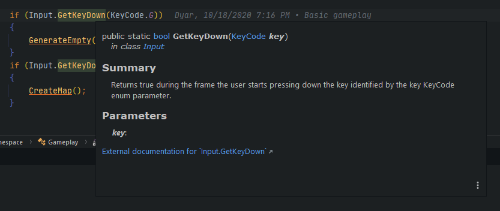
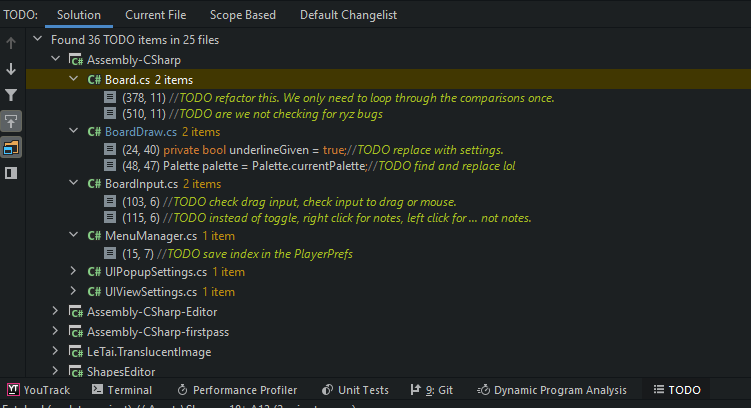
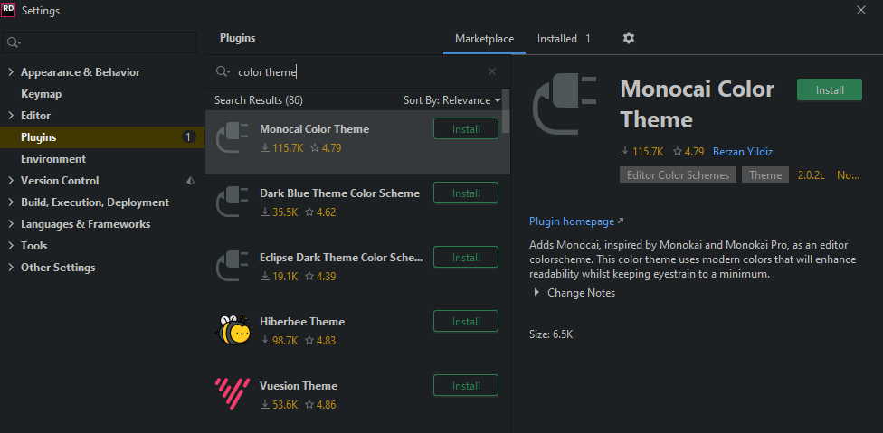
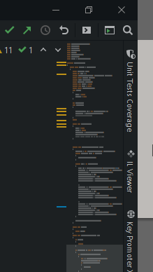

Favorite Rider Plugins, Settings, and Features for Unity Development

Programming is hard! Luckily, we have tools and features that help us
with this. Rider is not just a text editor. It's a full IDE --
Integrated Development Environment. It has many features and tools that
make programming much easier.

Programming is still going to be hard even if we take advantage of all
the features Rider can offer. But at least we can spend time working on
the challenges that matter and spend less time being frustrated by
syntax errors or typing the same thing repeatedly.

These are some of my favorite tips tools tricks and features of rider
that should help make your life easier.

Key Unity Features Overview
===========================

Before getting my opinions, check out the overview of Unity features
that are built into Rider: https://www.jetbrains.com/help/rider/Features_Unity.html

Your Keymap
===========

When you were installing Rider it asked you what you wanted to use for
your keymap. A keymap is just the keyboard shortcut layout. Ryder has
multiple sets of keyboard shortcuts which makes it easy to transition
from one piece of software to another. I recommend you use the
**IntelliJ keymap**. This keymap was created by the developers of Rider.

The main reason to use it is because it\'s what I use and if you\'re in
my class and I\'m explaining how to write code, I\'ll explain the
keyboard shortcuts and it will work for you just like me. Otherwise
it\'s all arbitrary, and you can use whatever you like.

I think most importantly you should be able to go in and change the key
keymap and customize it and feel comfortable doing so. If there is a
feature you find yourself using all the time put it somewhere that you
can get to it quickly! You can always revert to defaults. The software
is yours and you should set it up to behave like you want - or at least
just not be so annoying.

Search Anywhere
===============

Tap the shift key twice. This brings up a popup window with the search
bar. In that search bar start typing. Typing what? Whatever. You can use
it to find menu items or hard-to-find actions. You can use it to switch
to a different file. Type in the name of a function and you can navigate
there quickly.

Using Search Anywhere to quickly switch to a different file

Search anywhere is the most useful keyboard shortcut you can learn.
(Second to Ctrl+S: save).

The Structure Window
====================

On The left-hand side of the screen there\'s a tab that says
"Structure". This opens the structure window. I like to keep it open
below the File Explorer on the left. Inside of this is an outline of
your code. Essentially, it's a table of contents. You can easily
navigate to different functions in variable declarations just by
clicking around. It is also nice to look at as an overview of your code
or to remember the name of that function without having to scroll up and
find it.

Autocomplete
============

First: Control+space. This is the keyboard shortcut you didn\'t know you
needed. It will open the autocomplete dialog box for wherever your
cursor is. Normally that autocomplete box opens automatically, but
sometimes it won't be there when you want it to be. Just hit
**ctrl+space** to bring it back.

This is especially useful for fixing typos, capitalization, another
small changes that can be annoying to type out.

Template Completion
===================

One of the autocomplete features is something that rider calls "live
templates". Rider can fill in common bits of code for you.

"For" is one of the keywords that brings up template completion. It has
a dashed box icon and the orange text that says '*Simple "for" loop*' on
the right. Hitting enter on this will write out an entire for loop for
you and move your cursor along the different parts that you might want
to change. This is an incredibly useful feature - I use it all the time.

Rider has Unity-specific templates too. Try typing "log" which will
auto-type "Debug.Log();" and put your cursor inside the parenthesis.
Awesome.

A list is available here: https://www.jetbrains.com/help/rider/Reference__Templates_Explorer__Live_Templates.html

But you can find all of them in Settings\>Editor\>Live Templates

*(Related, check out the alt+insert "generate code" menu. Never type
(and misspell) an event function again!)*

Reformat Code
=============

Automatically fix all your indents and line breaks with "Reformat Code".
The keyboard shortcut I always forget, but we have the shift+shift
Search Anywhere box to find it. *(Oh look, it tells us right there,
Ctrl+alt+L).*

Quick Documentation
===================

My absolute favorite Rider feature is called "quick documentation". With
the cursor on any function, variable or class name (basically
*anything*), Use the shortcut CTRL+Q to open the quick documentation
popup.

*The popup for the "GetKeyDown" function of the Input class.*

This window will tell you a functions parameters, return type, and a
summary of what it does. Perhaps most importantly for unity development
if you use this pop up on a unity class or function it will give you a
link to the external documentation otherwise known as the scripting API
which you should already be familiar with. Opening the scripting API
right from Rider is extremely useful, and you should be using this
feature constantly.

*You can write in-code documentation for your own functions that will
appear here. Learn more: https://docs.microsoft.com/en-us/dotnet/csharp/programming-guide/xmldoc/*

Go to Definition
================

with your cursor on a function or variable name you can press **ctrl+B**
to immediately move your window to where that variable or function was
defined. You can also hold ctrl and click on the variable.

*Careful! If you do this to one of Unity's built-in features, Rider will
unhelpfully open that code written by some unity software engineer in
some file you shouldn't be touching. This is almost certainly not what
you want.*

Sometimes you don\'t want to leave your current editor you just want to
look something up in that case press control+shift+I which will open a
popup window allowing you to look at the code from where this variable
or function was defined. Neat.

More:https://www.jetbrains.com/help/rider/Quick_Definition.html?keymap=primary_intellij_windows

Navigate Previous and Next Location
===================================

Ctrl+Alt+Left and Ctrl+Alt+Right will move your cursor to the
previous/next place it was. Great for quickly jumping between typing
locations without having to scroll around or click through file tabs.
Just try it!

The ToDo List
=============

Type a comment with the word "todo" (no space) in it and writer will
automatically find and highlight that comment. It will add the comment
to a todo list that you can easily see and look through. Find the
'TODO:' window along the bottom. It displays the full comment from your
code. You can write reminder todo's is all over the place exactly where
they are relevant, and then look at them from one handy window.

The TODO window is easily accessible from a tab at the bottom of the
rider window.

*You may want to learn about Scopes. Then set up a scope for the TODO
window that only looks at your scripts, or scripts in a certain folder
in your assets. That way you won't see todo comments written by other
people's code in Unity or things you got on the asset store.*

More Info:
<https://www.jetbrains.com/help/rider/Navigation_and_Search__Navigating_Between_To_do_Items.html?keymap=primary_intellij_windows>

My Favorite Plugins
===================

To Install a plugin, go to File\>Settings... and find the "Plugins"
section. At the top, select the "Marketplace" tab, and then you can
simply search for the name of the plugin in the search bar.

I like to sort by Downloads to see the most popular plugins or themes.

CodeGlance
----------

CodeGlance turns your scrollbar into a minimap.

Rainbow Brackets
----------------

Rainbow Brackets colors opening and closing brackets to match each other
and makes it easier to visually identify what goes with what. It makes
deep functions or long complicated if statements just that much easier
to parse.

Key Promoter X
--------------

Key promoter as an unobtrusive popup box when a user feature that has a
keyboard shortcut, gently reminding you what that shortcut is. Now you
can just use rider like you normally do and learn shortcuts to features
you use over time. This is nicer than having to sit down and memorize
them intentionally.

CodeTogether
------------

Code together is one of many plugins that offer functionality for
something called pair programming.

Pair programming allows multiple users on different computers to edit
the same text file at the same time. Sort of like Google Docs. It\'s
amazing how useful and helpful this can be, especially while working on
a team project.

If you are thinking of sharing your code over a zoom screenshare,
seriously consider using a pair programming plugin instead.

I use CodeTogether because it\'s low-barrier to teach with. It allows a
student to use their web browser without opening software or installing
plugins. Code With Me, Floobits, GitDuck, GitLive, and more have their
own pros and cons.

Nyaan Cat Progress Bar
----------------------

Self-explanatory.
