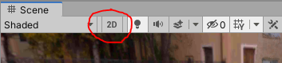
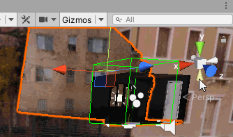
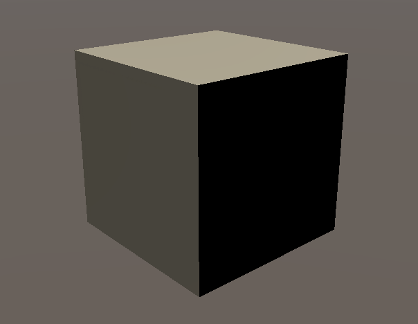
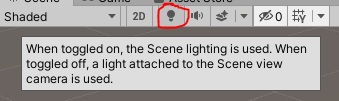
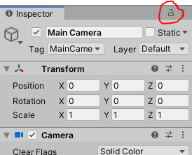

## Unity Engine Seems Broken...

Problem | Solution
--- | --- | ---
Double clicking on a script doesn't do anything |  Go to Edit>Preferences > External Tools and check that you have assigned a script editor. Try launching that editor independently, then double clicking a script. Close and re-open unity with the editor open and try again. 
I can't enter Play mode. | Open the console (window > Console). Hit "clear" in the console window. Are there still any compiler errors? 
Strange error messages I don't understand in the console | Hit 'clear' in the console. Any errors that don't go away are compiler errors and need to be fixed. Sometimes Unity will hit a bug, spit out an error, but keep trucking, or try again and things work the second time. It's cool like that. 
The game won't enter Play mode | First, it sometimes takes a few seconds to enter play mode. More likely, you probably have a compiler error. That means the problem is a script. Open the console if it's closed, and hit "clear". Take a look at any errors that don't go away, they are what's keeping you from entering play mode. 

## Interface Seems Broken...

Problem | Solution
--- | ---
Can't rotate camera in scene view | Check that 2D mode is turned off. 
Cant rotate camera in scene view | Check the Perspective/Orthographic (**iso**metric) toggle below scene gizmo. 
Everything looks kind of dark and has a brownish color in the scene view.  | Turn on auto-generate lighting. Double click on "Auto Generate Lighting" to quickly open the lighting settings window. 
I can't see any handles or icons in my scene | Make sure "Gizmos" in the top of the scene view window is selected. For object specific controls like Cameras or Lights, make sure that gameObject is selected.
I've rotated an object and can't move it up or down, only along its rotation (or vise versa). | At the top there is a "Local/Global" toggle that will change the reference frame.
I've lose a window and can't get it back. | open new windows back up under the hierarchy menus. windows can have more than one instance open. You can reset everything with the layout dropdown in the top right corner of the screen
When i hit play, the Unity UI does/doesn't get tinted a weird color? | edit>preferences>colors> Playmode Tint. Choose something that will remind you "i'm in playmode and my property changes wont get saved" but also not completely black

## Lighting is weird...

Problem | Solution
--- | ---
The scene view doesn't look like the game view | Check the "Scene Lighting" toggle. 
Lights don't do anything | Check light position, orientation (for spot and directional lights), radius and strength. Check the scene lighting toggle (see above). Check that they are runtime (or, if they are baked only, check that the objects are static or if there are light probes). Check the intensity of your ambient light (lighting settings), and that its not like 800 times brighter than your realtime lights. 
My model doesn't have any color | You may need to recreate a material, assign it the appropriate texture/normal/etc maps (if you have them), and assign that material to the object. Unity does it's best when importing/converting materials, but not all work just by nature of being for different rendering engines.
My model doesn't have any color | If your model has vertex colors, Unity's built- in default material shader won't render then. You need a vertex color shader. If you import the "[Polybrush](https://unity3d.com/unity/features/worldbuilding/polybrush)" package, it will include some shaders that support vertex colors.

## Unity is really hard and annoying to use

Problem | Solution
--- | ---
It's very difficult positioning objects correctly in 3D space | Top right, try the "4-split" layout. Focus on moving objects one axis at a time, and check your rotation constantly. After creating an object, check it's position first (zero'd out, or like, in the middle of nowhere?).
I can't find a menu option? | Hit alt+' ' (alt+apostrophe). This will either open the quick search bar or ask you to install the Quick Search package, which you should install. When you can't find a menu item, hit alt+' and type the name of it instead. This tool is designed to quickly find assets in the project, but will also search through menu items.
I don't have a mouse with a middle click button! | If you have a right+click button, pressing that and WASD to fly around the scene can help, and you can make that a keyboard shortcut instead. Press 'Q' to switch to the hand tool, which isn't necessary with a middle mouse button, but now lets you pan and rotate the scene view with right and left click.
I want to rotate an object around a different point in space | Make an empty gameObject and move it to the point. Drag your object on top of it in the hierarchy, to "child" that object to the empty "parent". When you rotate the parent, all it's children will rotate appropriately. 
Unity doesn't have any tools for 2D! | The default project template includes 3D packages and not 2D ones. Either start a new project with the 2D template, or - much easier - go into the package manger (window>package manger > all packages) and install the tools you want, like 2D Sprite and 2D Tilemap Editor.
I can't drag an asset into a slot in the inspector, because when I click on it, the inspector changes! | Click the little lock icon at the top of the inspector window. Don't forget to unlock it later. You can open multiple inspector windows and keep some of them locked on certain items, if you wish. 