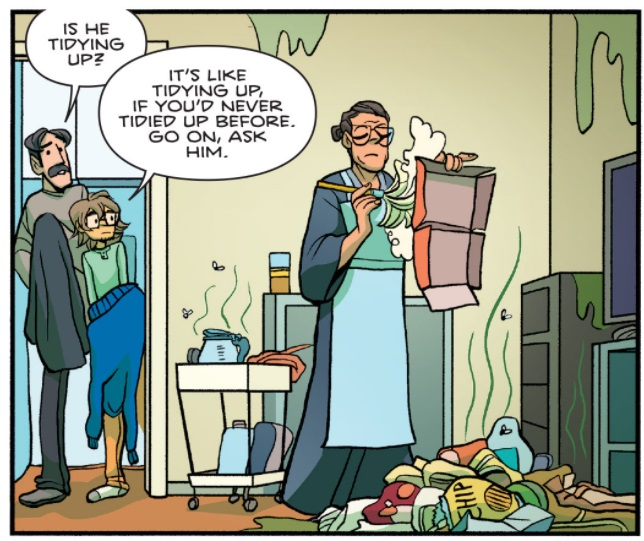

This section may more accurately be titled "Perceiving space: Other", as senses other than touch, like smell, will be discussed here. The sense of "self" is separated and discussed over [here](PerceivingSpaceSelf.md). This page focuses on external "feeling" senses. 

[Sight](perceivingSpaceVision.md) and [Sound](PerceivingSpaceAcoustics.md) may be the primary tools we have to perceive space, but they are also the most processed and assembled from a variety of cues and knowledge. They are the most mediated, illusory, and thus manipulatable. Much harder to manipulate is our sense of touch and our sense of selves. 

While this presents a challenge to designers, it's also why experiences that effectively consider these senses can be among the most powerful and effective.

Fist, lets discuss what to do without the senses we don't have control over. Despite the lack of [consumer-available olfactory instigators](https://en.wikipedia.org/wiki/ISmell), a designer must be aware of what kinds of things are not in their control, as it can help them learn where to focus their efforts.

### Tackling a Lack of Input Through Other Means

VR Devices are currently very limited in their haptic output. They also have basically no ability to affect temperature, air condition, or smell.

Consider an environment that, in real life, would carry a strong smell: a kitchen, a meat locker, a sewer. The design of such places requires greater care and thought, precisely because we are currently unable to use the smells to signal the player of their environment. We must make up for this lack in other ways. 

> I'm just using smell as an easy example here. Consider walking along the sand of a beach. In VR, we can't make the ground feel like sand. So how do we A) Get this specific idea across (probably footstep sound design) and what other elements can we bring in to help sell "beach" (we could include animated waves, seagulls, a distant pier).

TV, Graphic Novels, Illustration, and ... basically all other storytelling mediums except for scratch-n-sniff stickers don't have smell, and they still manage to communicate it. It's possible to borrow the visual language these mediums have developed.

*Stink lines, flies, hyperbolic stains, and a green tint signify smell in this panel from the comic *[Giant Days](https://www.comixology.co.uk/Giant-Days/comics-series/37051)* by [John Allison](http://www.scarygoround.com/#), illustrated by [Max Sarin](http://maxsarin.com/).

In media, sewers often contain a highly unrealistic and borderline magical green fog. The fog - thick, floating, and so uncannily-colored - carries the idea that one would be able to *feel* the smell of this place.

Also consider what an actual apartment kitchen may look like: a cabinet, a counter, a range, a sink. Now think of an image of a kitchen as informed by representations in visual media: pots hanging from the wall, a magnetic bar holding knives visibly silhouetted on the wall, some stains, a patterned drying rag, a surprising amount of counter real-estate full of pans, blenders, mocha-pots, and more. Does nobody put things away? The designer of whatever space you may be imagining has done a lot of extra work on the visual imagery of a kitchen. They have filled it with signifiers that represent "kitchen". Kitchens contain a lot of unique objects and shapes! But magnetic knife holders and hanging pots are not as popular a kitchen element as video game levels would have you believe.

Consider environments that would normally present themselves with the various elements discussed on this page, such as smell. Consider what kind of work can be done to make up for this through other elements. What is the equivalent to "magical green sewer fog" that can help you signify and identify locations that lack signifiers we have access to? 

