First, one must know that an understanding of space does not come from merely looking at the space. There is a phenomenal degree of what we might call "processing". We do a lot of mental work to go from what our sensors (eyes) report to an accurate understanding the world around us. What we see is not what we get. Our vision system is constantly combining and making sense of a large quantity of sometimes-disagreeing information, and it always attempts come to some cohesive result that it could be said to "present" to our conscious.

Optical illusions are results of disagreements between separate information pieces that we can't "wrap our minds around". 

We must understand many of the tools and tricks that our brains use to correctly perceive space in order to better present space. 

## Vocabulary
*wip*
## We See Depth
Understanding and perceiving our space is largely a process of understanding depth. We can only look in one direction at a time, and we really only look at one *thing* at a time. How far away is that thing? How large is it?

Eyes receive light projected through a lens in the eye onto photo receptors in the back of the eye. These photoreceptors are not depth sensors. They detect light and color. Like the film in a camera, they don't know anything direct about how far away any ray of light came from. Our brains have to deduce depth from a variety of cues, merging them all together to an understanding of space. This page covers many depth cues the human vision system uses. 

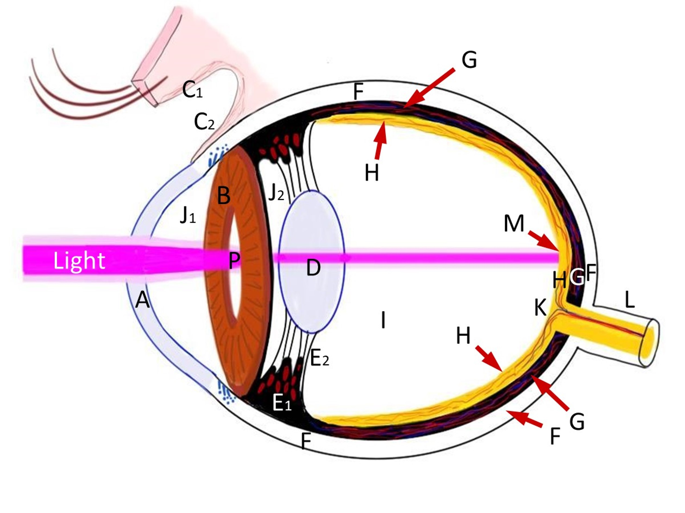
*Eye Diagram by Chris Sullivan. [Wikimedia Commons](https://commons.wikimedia.org/wiki/File:Eye-Diagram-Cartoon-Eyeball-2019_02.jpg).* [Here](https://commons.wikimedia.org/wiki/File:Eye-Diagram-Cartoon-Eyeball-2019_04.jpg) is a version with labels.

There is much more to talk about when it comes to vision and how we construct a mental model ("understanding") of a space. This page will focus on the understanding of depth, which is the principle tool used in this process. Some "next steps" would be to study optical illusions, emotional impacts ("feeling") of certain spaces, and architecture.

### Stereoscopy
Comparing The difference between the image received by our eyes.

Consider that for objects that are very far away, there is almost no difference between the image projected onto both of our eyes. Stereo vision has limits to it's accuracy, and that accuracy is directly related to distance.

It's often concluded that stereoscopy is effectively "one-eyed for distances of about 20 feet or more", although [newer research](https://jov.arvojournals.org/article.aspx?articleid=2191614) has shown otherwise under testing conditions. That said, the effectiveness of stereoscopic vision still decreases significantly with distance. 

In fact, in VR, there's a precise distance where we lose stereoscopy entirely. A distance where the difference rendered on the displays is smaller than the "width of a pixel", so to speak. i.e. It's a change smaller than the resolution of the headset can display as different. 

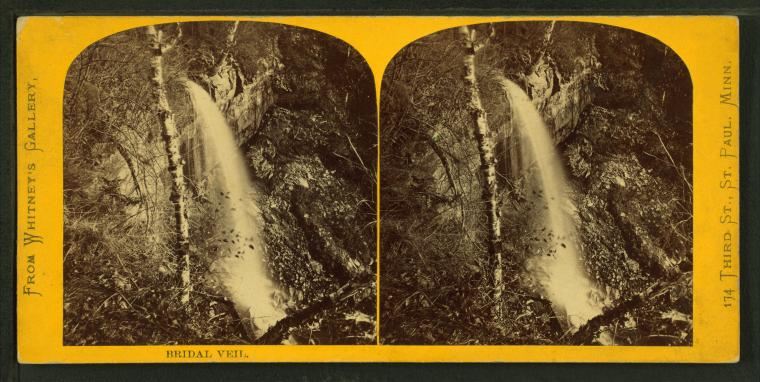
A stereo print. From the [NYPL archive](https://digitalcollections.nypl.org/items/510d47e0-914e-a3d9-e040-e00a18064a99).

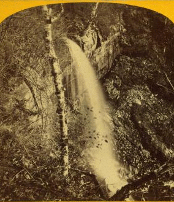

The above image animated using the NYPL [Stereogranimator](http://stereo.nypl.org/) tool.

### Convergence
We are aware of our eye muscles, and the angle they are looking: Go cross-eyed. Now look very far away. As we focus on different objects at different distances, our eyes are angled at different amounts (from cross-eyed to parallel). We are aware of this angle, and thus can use this information to deduce how far away we are looking. 

This physiological cue is less precise the further away something is, and breaks down completely for objects that are extremely close.

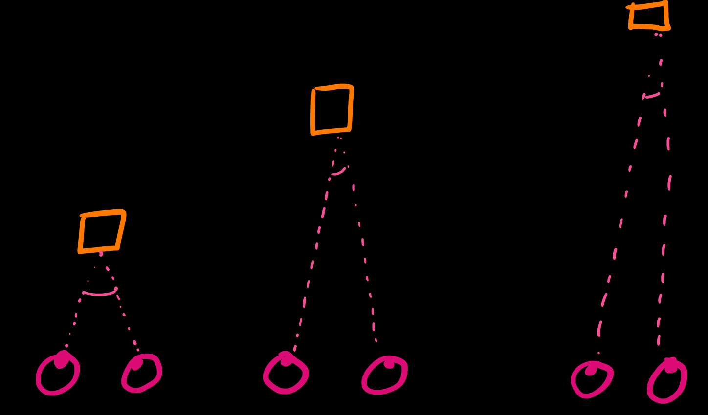

### Accommodation
Similar to *Convergence*, Accommodation is also a sense of muscles in our eyes. But it's the sense of the muscles we use to alter the shape of the lens in our eye *(D, above)* to refocus light that is coming from different angles. Different angles means different distances.

Accommodation is the most similar to how regular camera optics work.

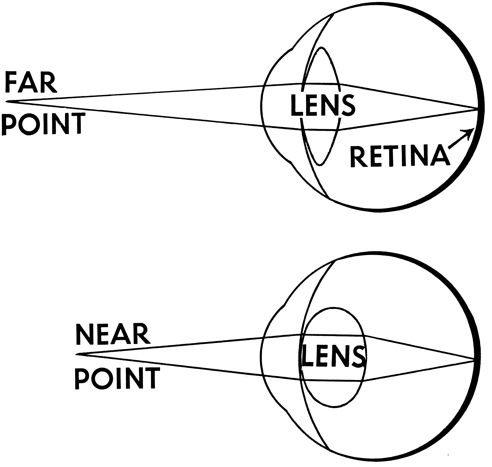
*[Accommodation Diagram](https://commons.wikimedia.org/wiki/File:Accommodation_(PSF).png) from Pearson Scott Foresman archives. CC0.*

### Linear Perspective
Perspective is a lot to cover, I will assume you understand the basics. More [resources](PerspectiveDistortionAndProjections.md) on perspective will be available soon.

It's one of the most important depth cues that we have for understanding environments. The reasons photographs and renaissance paintings "look real" is their use of perspective that matches our expectations and perceptions of space well.

There is a lot to be said about what can be achieved by breaking and cheating with linear perspective, but in VR, this tends to be outside of our control as designers. Instead, we need to know how to reinforce and manipulate the effects of perspective. We do this by providing architectural environments with clear angles and visible straight lines/edges (or not), by letting our environments extend to the distance (or not) and being sure not to confuse perspectives in one environment. 

While one might think that the virtual camera achieves linear perspective for us, in 3D engines that we are producing VR inside of, the boring truth is that it's just not enough. Open up a VR scenes and float some cubes around you. Do you know how large they are? How far away they are? Probably not. Ground your objects inside of scenes - like rectangular rooms with repeating details, give the ground and walls texture, like tiles floors - and otherwise provide the visual information that becomes perspective cues when projected in linear perspective.

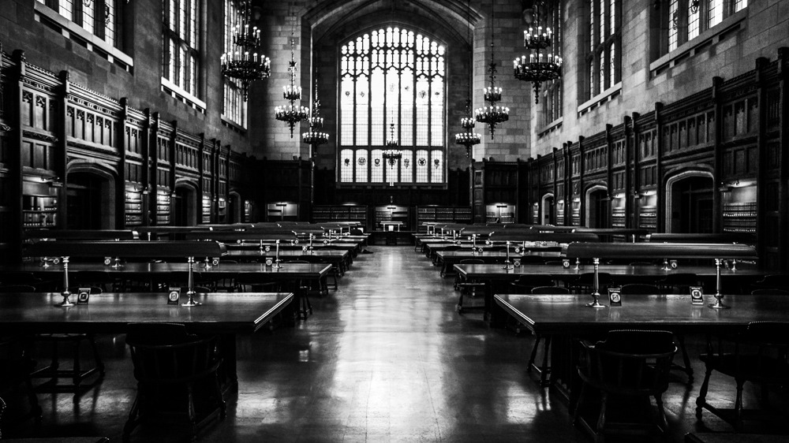
*University of Michigan Law Library. An image with strong linear perspective, there's a clear vanishing point in the center of the image.*

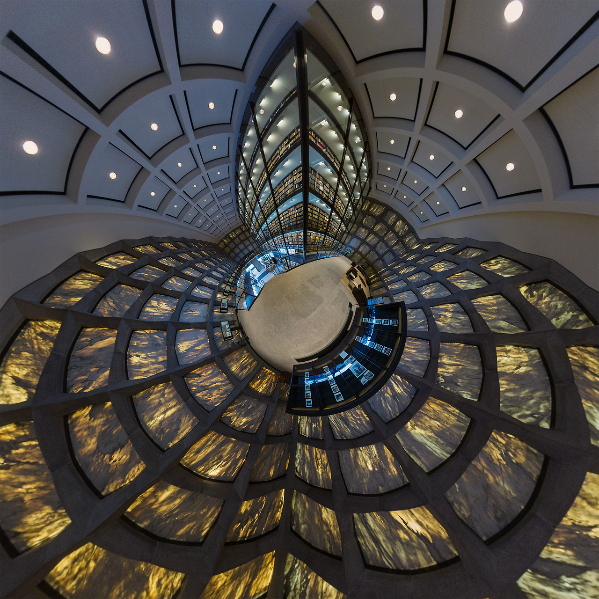
*This image of [Yale's Library](https://upload.wikimedia.org/wikipedia/commons/3/36/20170420_Beinecke_Rare_Book_Library_Interior_Yale_University_New_Haven_Connecticut.jpg) was shot with non-linear projection. Straight lines are not straight, and parallel lines are not parallel nor do they converge to a single point. This image uses [stereographic projection](https://en.wikipedia.org/wiki/Stereographic_projection).*

The below image is off-putting because it showcases two perspectives - one on the projected screen, the other in the art gallery - that are incompatible. As a photographer, that's why I like this image - it *doesn't* work. It's clear why, but is still uncomfortable to look at. The on-screen perspective is *close* to the real camera perspective, our brains make an attempt at fitting it all together. We want to bend the world and make it work. It doesn't.

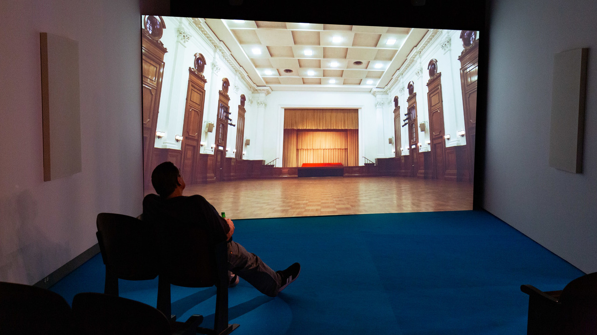
*If the projected screen was a TV instead - one with solid borders that demonstrate the 2D surface the perspective image is on - the image would be less uncomfortable to look at. Borders and frames can provide a reference for establishing planes and perspective.*

This image is an equirectangular projection of a 360 image captured from the center of a radially symmetric room. Everything is the same distance away, so it's all the same size. 
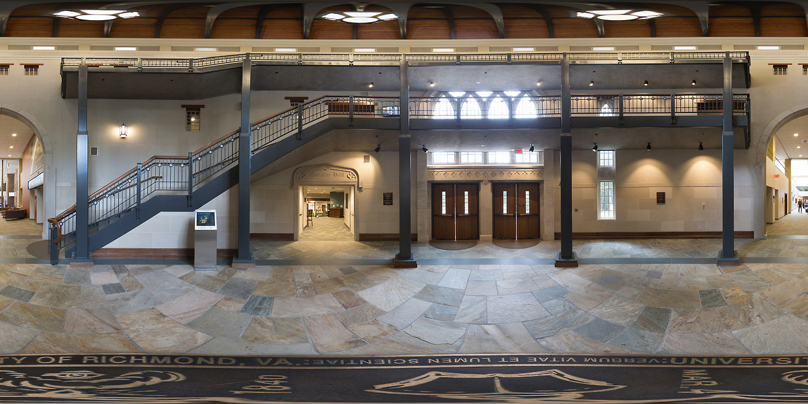.

### Perspective Distortion
"Perspective Distortion" is ... perspective. Things get bigger as they get closer to the viewer. Things that are further away are smaller. That's all perspective distortion is.

I am separating it from the above section on linear perspective because I want to emphasize a difference:

1) Creating vanishing points and a grounded spacial environment with repetitive objects
2) Making objects appear closer or further by making them bigger or smaller

When things of different distances appear to interact with each other, our sense of perspective can be completely broken. The following is a "forced perspective" illusion, and a rather fun photography trick to try. You've likely already seen the "pushing the leaning tower of pisa" photos.

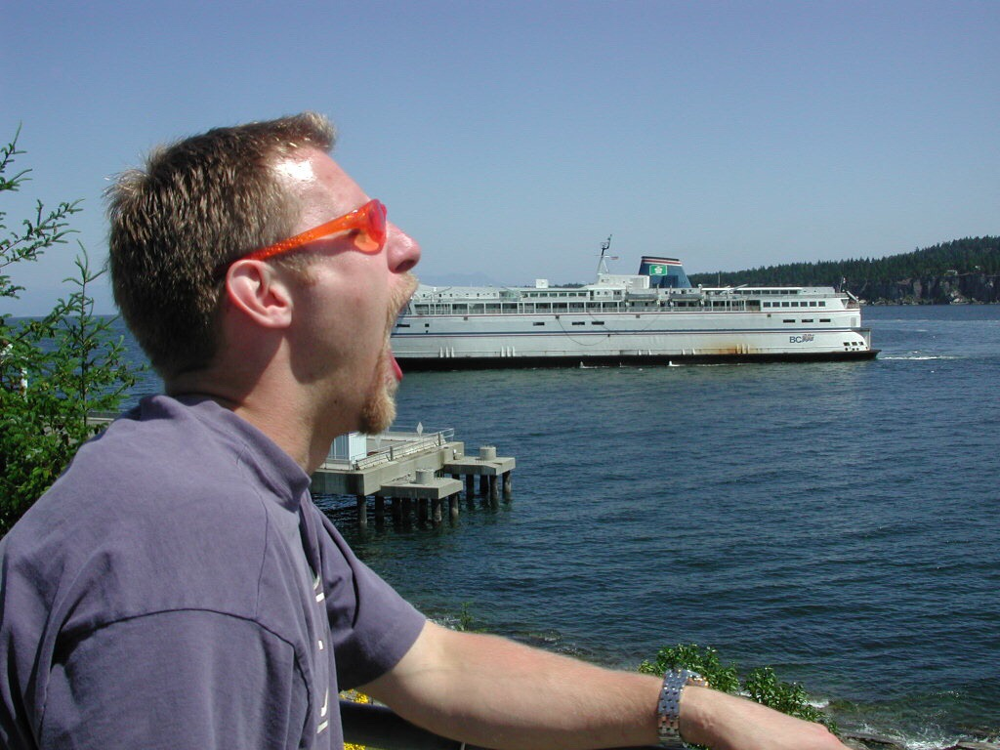
*Duane Stormy - Forced Perspective*

### Motion Parallax
In addition to stereoscopy, we also can move our head around and compare the differences. This relative difference in objects of different distances as the viewpoint changes is the effect of *parallax*. 

Not just comparing different positions, but the mere act of moving our eyes provides information - we are keen to notice motion.

Move your head about. You don't need to move it much, just a bit. Pay attention to how something in the foreground moves against the background.

Consider how when you look at something far away, you squint, you crane your neck forward... and you bob your head side to side. That small side to side movement is a subconscious little action for estimating the depth of what you are looking at, by seeing how much it moves relative to what's around it. The relative perceived speeds of objects at different distances is *motion parallax*.

*Many 2D Games imply depth through motion parallax. Notice multiple different background planes that move at different speeds, implying depth. Even with such a low level of "realism", there is an incredible presentation of space and depth.*

Even incredibly complex scenes of hundreds of thousands of otherwise similar points can "click" into an understanding in mere moments. 

*Correctly selecting and editing points in the 3D scanning software Metashape is challenging. One must constantly pan and rotate the view in order to make sense of the point cloud. Mis-selections and incorrect assumptions are frequent. Effective work in the software requires constant double checking and re-evaluating what one is "really" looking at, primarily acquiring this information via motion parallax.*

Motion parallax is an incredibly strong depth cue, and one of the largest advantages that VR can bring to the table. No longer needing large fast moving characters in 3D worlds, VR Developers have the freedom to slow down the "camera" and let small subtle motions provide the information, even from our periphery and while standing nearly still.

Motion parallax has it's limits, of course. Less effective for super far away distances, for moving objects (if you do dust motes, don't have them flutter too quickly), 

#### Dust Motes
Having small points floating around in space is an extremely effective way to establish space and scale in VR. Dust motes, bits of dust floating around, often require no contextual explanation for their existence, and they can go a long way to help.

Moss uses dust motes (in addition to a variety of other techniques) to establish space. 

*Ed Note: Attempts to capture the dust motes for visual example are destroyed by video compression. Just go get the demo and check it out.*

Dust motes don't need to be dust. Falling leaves, butterflies, insects, dust lit by volumetric rays of light, particle effects like impact sparks or motion trails, or even just an "unnatural" floating grid, objects floating about within arms reach (*see: I expect you to die*), 

### Object Motion
Consider parallax to be the motion of the camera/head, or consistently moving things that provide a sense of scale. **Object Motion** refers to the motion of objects. Big things move and accelerate slowly. Small and lightweight things dart around. A big door lumbers open and a floppy wooden saloon door flies open and swings/oscillates a bit before settling back into it's closed position.

This is an important design consideration when having objects accurately *feel* like their size. It's particularly important with things one interacts with, but is also important in environmental design and establishing space. In a game engine, this tends to be the tedious task of making sure the object properties are set up well in a physics engine, or animated appropriately.

*See the tilt-shift videography example below.*

### Frame
When an object is so large it can't be contained inside of a frame, we tend to assume it is large. This is... clear. 

This isn't really a spacial depth cue in the same way that others are, but it's an important enough quality that should be thought about in the same way as these other depth cues.

In VR, one may think we don't have a frame. But... the user can't see the entire world all at once. There's a frame. Large objects that extend outside of ones field of view will feel large, while objects we can observe without moving our heads will feel smaller.

Consider the opening shot of Star Wars for an incredibly effective example.

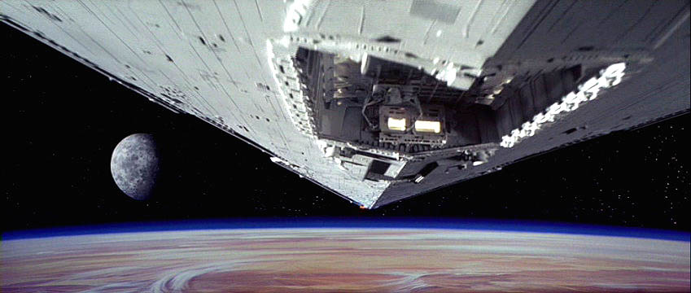

*The shot creates an expectation of scale - first with the small ship, and then with the point of the larger one moving past. It quickly subverts that expectation: the large ship just keeps going! It takes up more and more of the frame. The viewer is forced to continuously readjust their mental model of how big this ship probably is, which makes it feel all the larger. It's a [great shot](https://youtu.be/yHfLyMAHrQE?t=119).*

### Familiar Size/Relative Size (Reference)
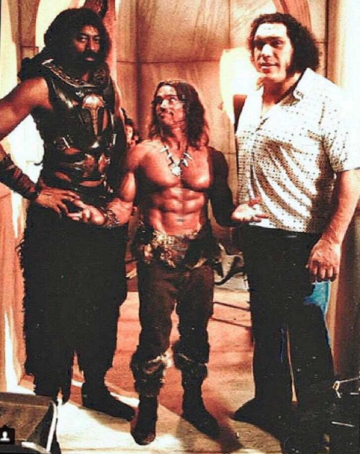

Guess who is in the center of this image? How tall do you think they are?

That's Arnold Schwarzenegger, who is around 6 feet tall. In this image he is flanked by Professional basketball player Wilt Chamberlin (7ft) and Wrestler/Actor Andre The Giant (7ft 4in) on the set of *Conan The Destroyer*. Notice how we don't have other objects in the image that are clear enough to provide reference, and we must use our knowledge of how tall people tend to be in order to understand the image. In this case, that "known size" is wrong.

[source](https://twitter.com/schwarzenegger/status/984478810400686080).

In my opinion, not giving the user relative/familiar size comparisons is one of most consistent design shortfalls of many VR experiences. We enter fantasy worlds with fantasy environments to do fantasy things, and it just doesn't quite feel *grounded*. The only relative scale we have is our own height, which stops being effective once things are a certain distance or offset about the environment. Give me some things with known sizes in them, at various places in the world. Not 1-cubic-meter wooden crates that are rampant in video games but nobody has ever actually seen in real life. How big is a barrel? I've got no clue, they don't help me understand scale at all. Maybe toss some cars in the background? Or potted plants! Plants are great. I'm a big fan of indoor potted plants.

This image of [Greg](https://www.gregstokinger.com/) was captured on the roof of a building in Pittsburgh. There is almost nothing to disconnect the foreground - greg - with the background. Just a small amount of blur and texture/detail level. Greg looks like he is the size of these buildings! Luckily our sense of relative sizes - and that small amount of blur - keep us from falling to a "forced perspective" illusion.
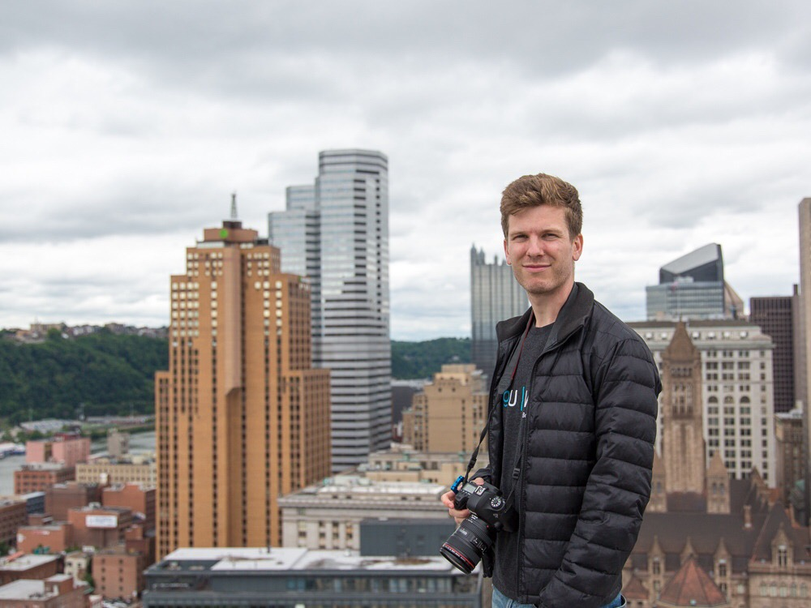

### Occlusion
If something is in front of (and closer) than something else, it will visibly block (or "occlude") that something else. Thus: Establishing relative positions. 

While occlusion does not provide a lot of independence, it is an unforgiving depth cue. Breaking occlusion can *really* break the illusion of space.

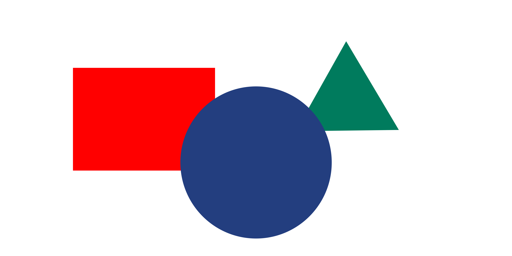
*Occlusion, Elevation From Horizon, and perspective distortion are the only depth cues present in this image.*

Above, note how occlusion works with elevation from horizon (the triangle is higher up) and perspective distortion (the triangle is smaller, the circle is largest) to present a space. Compare that to the below image which has occlusion disagree with the other two cues. The image does not present itself as a space.

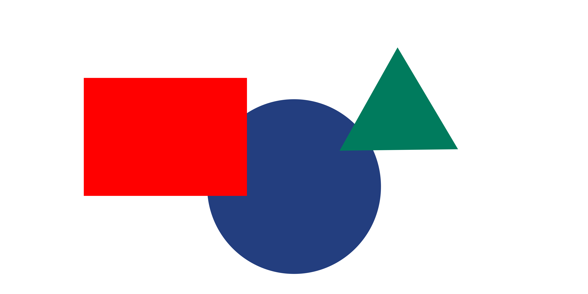

Occlusion can be remarkably effective, even though it can only generally only be used to order elements and their distances. It's extremely effective when combined with cues like familiar/relative size, perspective, and motion parallax.

> The way I like to think about it that has no basis in psychological research that I know of, is that occlusion gives us a quick "depth ranking" ballpark of spatial information, from which we can easily refine to an understanding with other cues.

One exception is intersecting objects, where an object with a known shape intersects or overlaps another object, it becomes partially occluded. Because we know what shape it *should* be, the information for where the shape it occluded becomes useful. Consider, in VR, having visual "hands" or "pointers" that overlap objects when you hover over them to pick them up. See Cubism below for an example of this.

> It's remarkable how effective a bit of overlap is when parsing a scene. When designing a level can be easy to fall into the trap of laying out everything "cleanly" without visual overlap. Do make efforts to break this habit and experiment.

See the breakdown on Moss below for an excellent use of occlusion.

### Shadows and Lighting
*wip*
### Textures and Detail Level
*wip*
### Size of Similar Objects
The same cue as perspective distortion/linear perspective and familiar size, taken together. I want to draw emphasis on objects that may not be of a *known* size, but of some size that we establish *within the environment*. By repeating this same object around the environment, size becomes an indicator of depth.

The human figures in this image clearly ground it's perspective and scale.
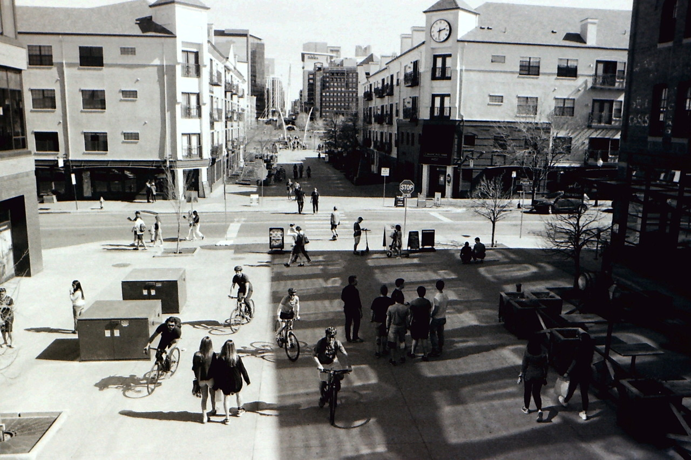

Notable examples: people, windows, streetlamps, vehicles, and so on.

Consider the tables/table lamps in the above image of the Law Library

The below image doesn't have very many depth cues. The metal bridge is ambiguously sized and out of frame, the road doesn't quite have all the markings of a normal street (of known size) (it's clearly smaller, it's a bike path), and turns and twists obscure any clear vanishing points. The strongest indicator of depth is the fencing, (ambiguous within a range) and the repetition of the fencing gives us a sense for how far away the red building is. We can more accurately estimate the distance to the building than estimate the width of the bike path.

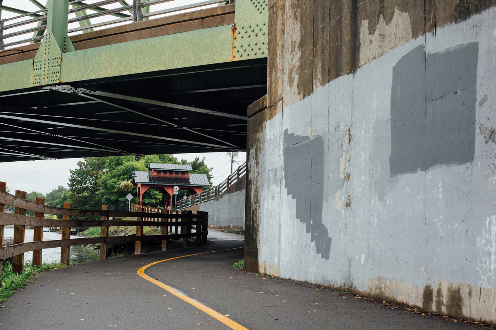

### Background-Separation and Object Recognition.
Our vision system is capable of identifying objects separate from their backgrounds. It's a complicated system, we will focus on the mere act of recognition.

*Object recognition* is not *depth perception*, but it is closely linked. Object recognition provides key indicators for depth perception that allow things like *occlusion* and *relative scale* to work effectively as depth cues. If multiple objects blur our blend into each other, or if it's challenging to distinguish them from the background, then the perception of depth and space will likewise be challenging.

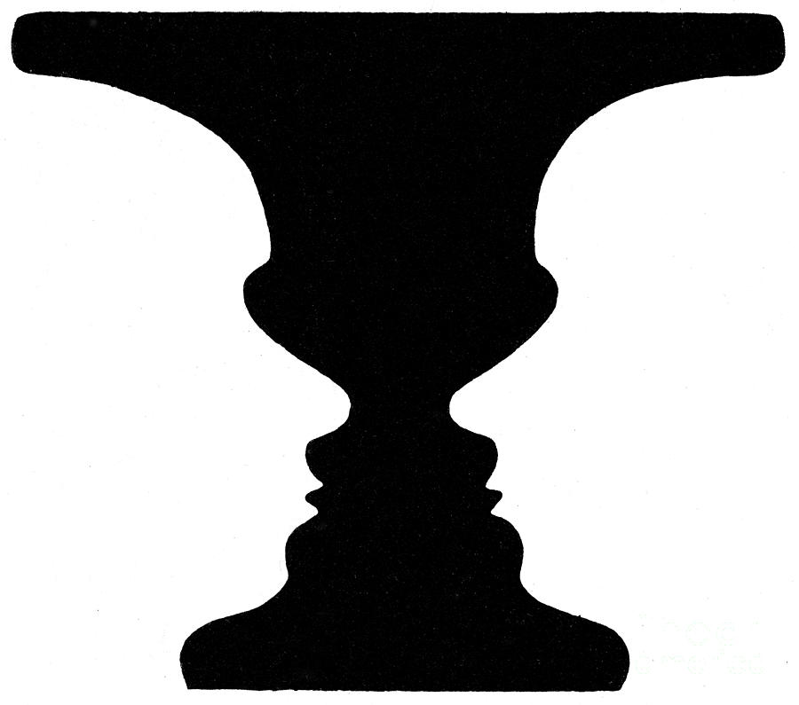
*This classic optical illusion depends on our recognition of figure and ground. Do you see a Vace or two faces? Whichever you see, that's the figure, while the rest fades into ground.*

The above illusion happens when *figure* and *ground* are mentally switched. But that's less important for us than a more common problem: when they simply *compete* or *confuse* one another. 

When we can easily recognize objects, we can use them to help us understand the space they are in.

For developers, that usually means having characters that stand out. In 3D environments where characters can move about freely, this is a challenge that is solved by effective lighting, character design, animation, and strong silhouette (or less subtle methods like outlines). For designing understandable spaces, it means making visible the distinctions between objects at different depth positions. Again, effective lighting is our friend. 

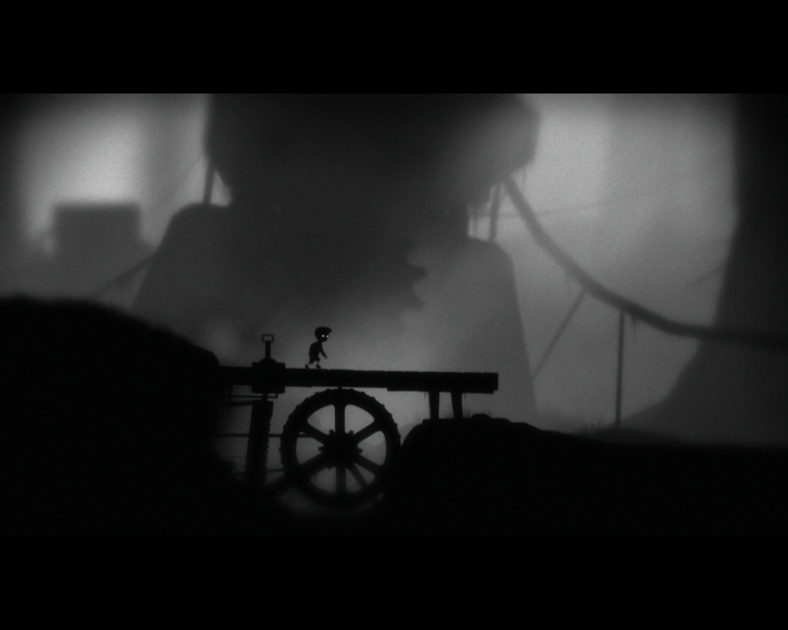

The 2D game Limbo uses a strong visual style that can make visually identifying the character challenging. It faces a figure-ground problem that it must tackle through a variety of means. While it will sometimes partially occlude the character with foreground elements, it often avoids that. The background is separated not just through lighting, but also the cues of *blur*, *fog*, and a texture effect that reduces the sharpness of the background elements and makes them visually distinct but not attention-getting. The main character has a recognizable silhouette, and his eyes are almost always the brightest element on the screen. He is also constantly in motion, even the idle animation is lively while the world - which is full of subtle motions - has animations that are generally slow, subtle, mechanical, or lumbering (terrifying spiders excluded).

All of these depth cues primarily exist to separate two planes "foreground" and "background". Little more spatial presentation is necessary for this stylish 2D platformer game.

### Kinetic Depth Effect

The shifting of a silouette can be reconstructed as a 3 dimensional shape moving through space, and we can understand the shape being presented. We can reverse engineer this information as a 3 dimensional shape.  

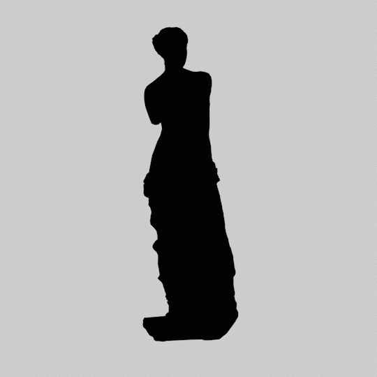

Consider the even more complex example. Unlike the above [human figure](http://www.venusdemilo.gr/), any given frame of this figure has very little information about what it is. But we are still capable of determining the shape.

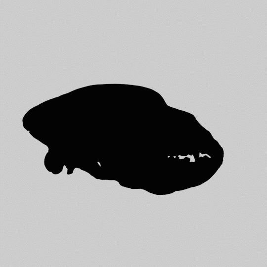

The 3D models used are [Venus de Milo](https://sketchfab.com/3d-models/venus-de-milo-statuestexturingchallenge-smk-2983d92ac4e744f485492580ca7629f2), and the [skull of a Brown Bear](https://sketchfab.com/3d-models/brown-bear-skull-e01dc94d20df4b888c7a6979bffb45a9). 

### Out-Of-Focus Blur

Our eyes focus on light (*ahem:* accomodation) in a way similar to camera lenses. Out-of-focus blur isn't just an indicator driven through familiarity with images captured via optics, but also our own vision. 

*See the tilt-shift example below at just how dramatically our sense of depth can be thrown off by an image with "incorrect" out-of-focus blur.*

*The deep background is extremely out of focus, the tree is less out of focus while Hannah here is sharp and in focus. Occlusion also clues us in.*

Consider this screen capture from *The Untouchables*. 

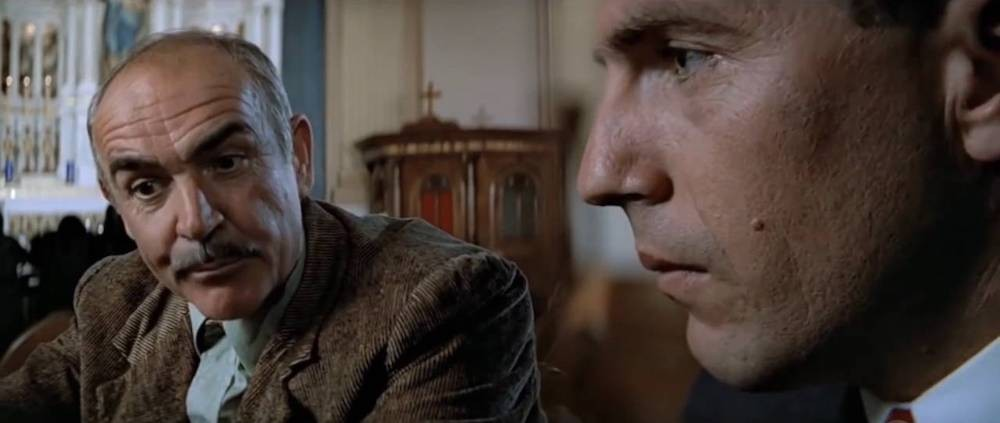

It was shot using a "[split diopter](https://vashivisuals.com/splitting-focus-de-palmas-blow/)". The effect is usually achieved by cutting a lens in half, perhaps combining it with another half-lens of a different focal length. This image feels fake and wrong to us (the effect is more subtle inside of the context, montage, and pacing of film, this screencapture rips it out and lays it bare). It is inconsistent with our understanding of out-of-focus blur, and thus feels fake, wrong, uncanny - and we are unable to understand the environment.

### Elevation From The Horizon
This depth cue is a generalization of perspective. As things get further away, they tend to approach the horizon (as they approach a vanishing point). When observing objects that are not too different in height or size, distance from the horizon is an effective cue. 

### Atmospheric Gradation
Atmospheric Gradation, sometimes called "atmospheric perspective", 
Air is clear, but not perfectly clear. There's fog, [haze](https://www.spc.noaa.gov/publications/corfidi/hazeintro.html), dust, smog, clouds, optical distortions like [mirage](https://en.wikipedia.org/wiki/Mirage), and more obscuring our ability too see long distances clearly.

As an object gets further away, this object's perceived contrast decreases, and it can visually shift towards blue or other colors. 

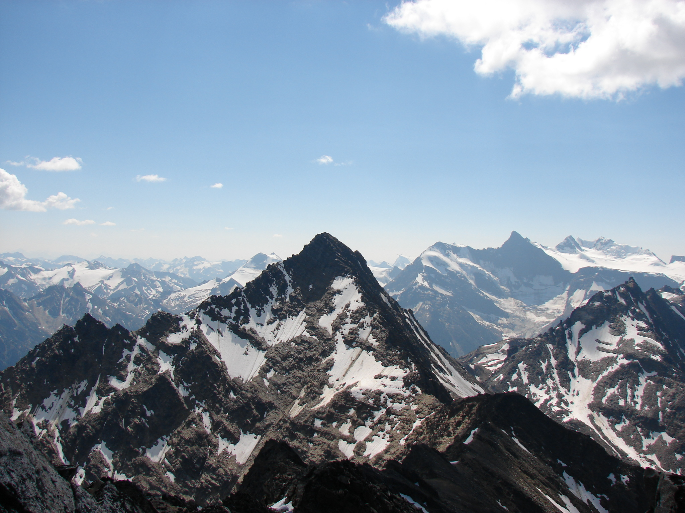
*[Peaks of the Premier Range](https://en.wikipedia.org/wiki/Cariboo_Mountains#/media/File:Cariboo_Peaks.JPG), Cariboo Mountains, from the summit of Mica Mountain, British Columbia. By Rufus Hawthorne.* Note the distant mountains lose contrast in addition to the blue tint.

Fog provides the same visual effect at a much more extreme scale.

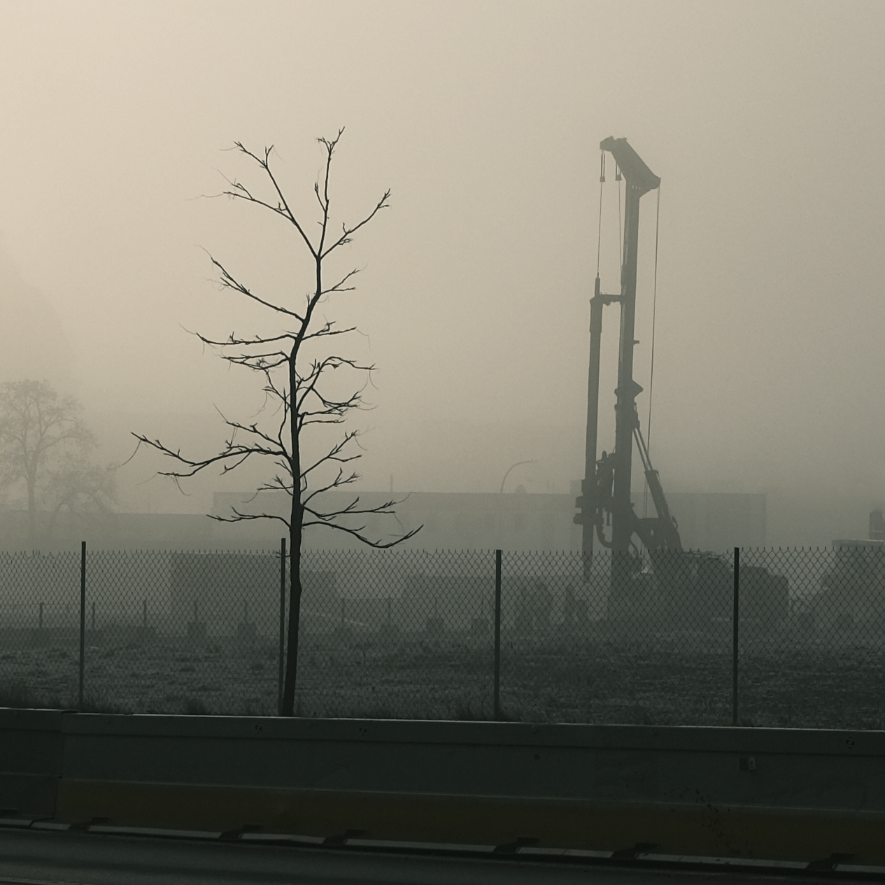
*Image shot on a foggy morning in East Liberty. Occlusion and dramatic atmospheric gradation provide depth cues.*

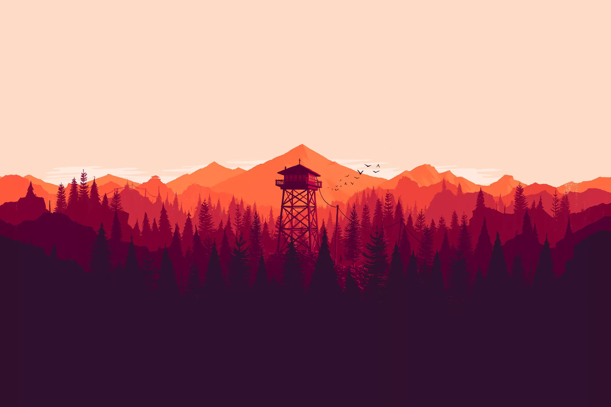
*Promotional image for the game Firewatch uses implied atmospheric gradation, as well as occlusion and horizon elevation, to present a vast vista out of a handful of solid colors.*

This is an image I captured on a different foggy morning in Pittsburgh. Again emphasizing that fog isn't just a tint, but also a reduction in contrast.

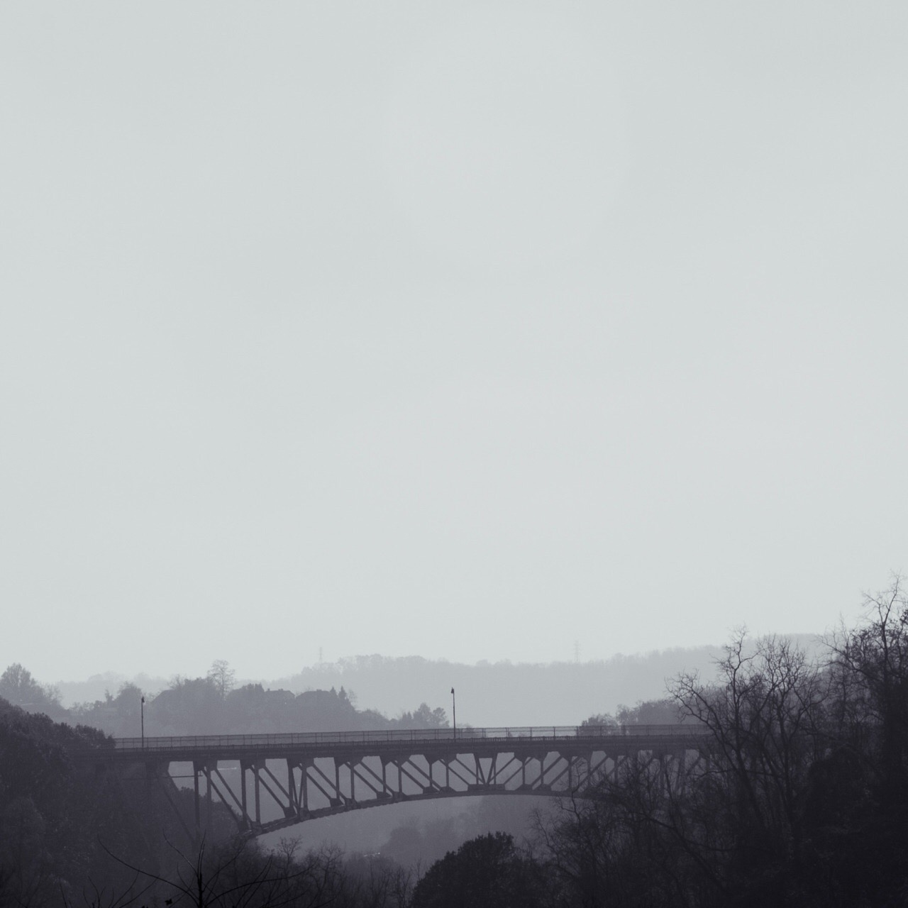

In VR design, a little bit of fog can go a long way.

## Examples Of Presenting Depth

### Moss

<iframe src='https://gfycat.com/ifr/GeneralQuarrelsomeBream' frameborder='0' scrolling='no' width='100%' height='100%' style='position:absolute;top:0;left:0;' allowfullscreen></iframe>

Moss uses a variety of depth cues.

Familiar Objects helps and hurts us. Large mushrooms, trees, rocks, and so on help bring us down to the small "diarama" mouse-scale of the world, but many of these familiar reference cues are ambiguous, and the scale could easily be lost. As a 3D platformer, an incorrect understanding - even by a small amount - will lead to the player missing jumps or falling off of ledges, to their frustration.

It's a VR Experience, so it get's a lot: Stereoscopy, perspective rendering, and more.

The first thing to note is the scale. It's a third person game, but why play at such a small scale? The scale has a number of advantages, notably motion parallax. Small movements of the players head provide a *lot* of depth information. There are a number of cues that decrease in effectiveness with distance, like sterescopy. The scale puts the world at a very comfortable distance, a sort of perceptive sweet-spot, with easily understood environments. 

> 3rd person VR Games are often compared to playing tabletop games. But Moss is significantly larger than a tabletop board game. Consider how **Tabletop Simulator** suffers as it asks for too much precision from the player, and for them to look downward constantly - harder while wearing a headset than when normally playing a tabletop game). Try this experiment: Go into Google Earth VR, find an interesting location, and mess about with the scale until it's just feels comfortable. How large did you make this environment? 

Interestingly enough, lighting/shading is not really used to establish space or scale. Ignoring the deep background, Moss has an aggressive use of highly unrealistic lighting that paint playable areas bright and non-playable areas in deep shadow. Notice how the large rock on the right is lit from *below* in the  above clip. It makes *no sense* in this situation, but entirely serves gameplay. That said, the strong and directional lighting provides some additional shape information and texture detail to the environment - the difference between the *top* and the *side* of a ledge is always quite clear, even for curved platforming elements like logs/branches.

Dust Motes (sometimes mystical particle effects) establish and enforce the small scale.

> *Ed Note: Many recordings of gameplay found online are recorded with lower graphics quality settings that limit fog and particle effects, and the wonderful dust motes are invisible.*

A thick fog clearly separates the background, and gives it depth. The background also contains "human" sized elements like massive trees, which help re-enforce the small scale of the world in front of us. This is important: in order for the the world in front of us to feel small, we need things around it to be large. Without these background elements, the scale of the experience would be hampered and it would feel less magical.

Occlusion is very important to Moss. It uses occlusion bluntly and subtly. Bluntly, it directly puts large elements in the way, which forces the player to move their head and look around in order to see the rest of the level - and thus giving them additional perspectives, motion parallax, and more to help them understand the space. When the mouse is occluded, there's a world-breaking x-ray effect that I personally dislike but accept.

The second kind of occlusion is more important. Smaller, minor elements occasionally obtrude the character and level. Leaves, grass, protrusions of rock, and other elements *just barely* get in the way. Without blocking sight to the character, they are a significant element to why the platforming works well. When the mouse runs through some leaves, their position in space is precisely knowable, without thought. One can compare the forrest levels of Moss to the castle levels, which have far less of these minor occluding elements - and a much less diverse visual environment - the difficulty of platforming increases in a frustrating way. There's less depth information to work with.

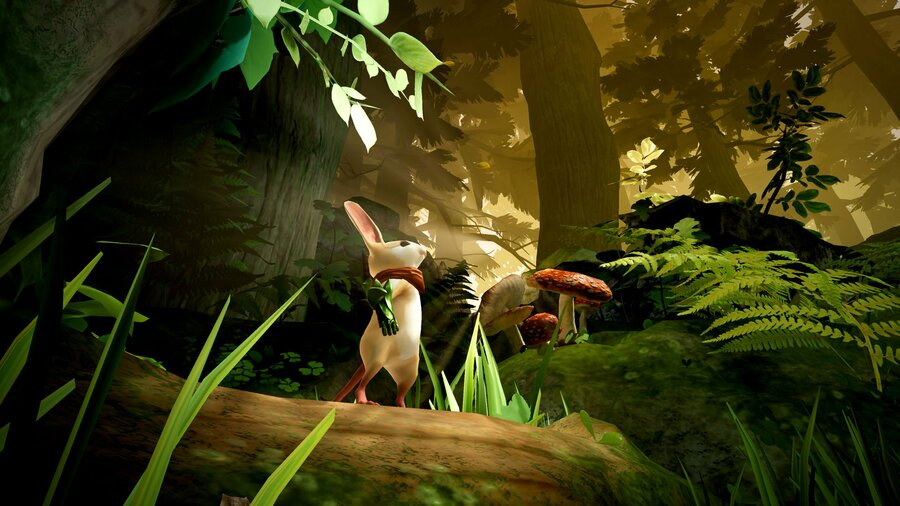
*A promotional image for Moss that shows various leaves that can occlude the character.*

The best Moss levels combine interesting dynamic geometry (they aren't visibly on a grid) with enough cues, particles, and so on to make up for the lack of clear perspective lines and player confidence that such a grid provides. Some of the interior Moss levels become more "2 dimensional" and suffer for it. That said, Moss rarely goes *too* far with it's dimensionality - you almost never have to move behind or around other paths, and little is obscured from vision. While moving ones head around is certainly required for gameplay, Moss is basically playable from a single perspective - an important consolation that improves comfort and accessability.

### River City Girls

[Beat-Em Up](https://en.wikipedia.org/wiki/Beat_%27em_up) games often mix perspective tricks with orthographic projection, presenting 3D worlds on a 2D screen, with 2D movement. The tricks they use to accomplish this are an interesting study. Lets consider *River City Girls*.

<iframe width="560" height="315" src="https://www.youtube.com/embed/MDrc5Jzm2wc" frameborder="0" allow="accelerometer; autoplay; encrypted-media; gyroscope; picture-in-picture" allowfullscreen></iframe>

There is no parallax due to the orthographic projection and 2-Dimensional engine behind the scenes. How do the designers present space? What visual cues are being used here?

The two major depth cues in this game are occlusion, which is obvious. The second is vertical position.

The use of vertical position as depth a blatant defiance of perspective. Specifically, the very perspective that the game's own background and scenery are illustrated in.

In the gameplay, the vertical position is the *only* element that effects depth. As you "further and closer" you move straight up and down. But consider the perspective presented by the background scenery. We can see the sides of many objects. It's.... wrong! But the objects are presented at such a steep projection, they do enforce vertical position as being related to depth far more than they enforce horizontal position being related to depth.

In the below screenshot, the dumpster and the truck are angled opposite to each other, implying a vanishing point that is impossible with an orthographic projection - things don't get smaller when they get further away. The objects are in conflict, but only in conflict in how they treat horizontal position/depth. They both enforce a vertical position to depth relationship the same way. 

We are left with confused or conflicting understanding of hor horizontal position relates to depth, and we casually disregard this confusion, while all objects in the scene enforce - with their own perspectives - the same relationship that attributes vertical position to depth.

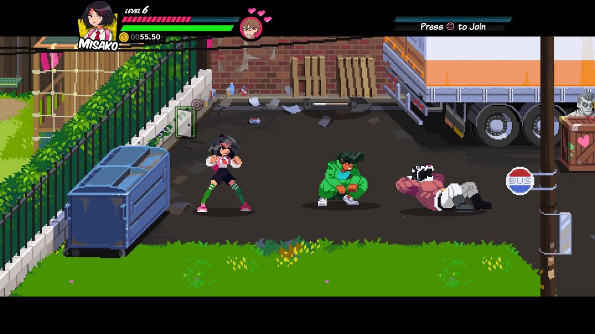

The game simplifies the world to and projection in ways that defy both perspective and orthographic projections, but it works. Everything reinforces the assumption of vertical position being related to distance. Combined with a number of reference objects, foreground objects and more. The system breaks when we have characters jump and when characters are different heights. The drop-shadow is present to provide a positional cue that relives this ambiguousness.

Consider if the scene were drawn consistently, the background all in the same perspective like that of the dumpster, moving left to right as it gets further away from the camera. If the environment had consistent perspective signals, then the character movement *would* feel incorrect. Instead, the incongruent background *helps* the movement feel appropriate by obfuscating the relationship between horizontal position and depth to the point where we disregard it.

As a designer, it can be impossible to do things "accurately". Even in VR. We must be aware of what we can provide that present clarity to ambiguous visual clues and "override" or muddle-up conflicting ones. 

### Cubism (demo)

*Press Gif from developer webpage.*

*Cubism* is a minimalist VR puzzle game, like a 3D Tanagram puzzle. By "Minimalist", it means "has basically no environment whatsoever". So how can a game that removes *almost everything* present depth and space to the user?

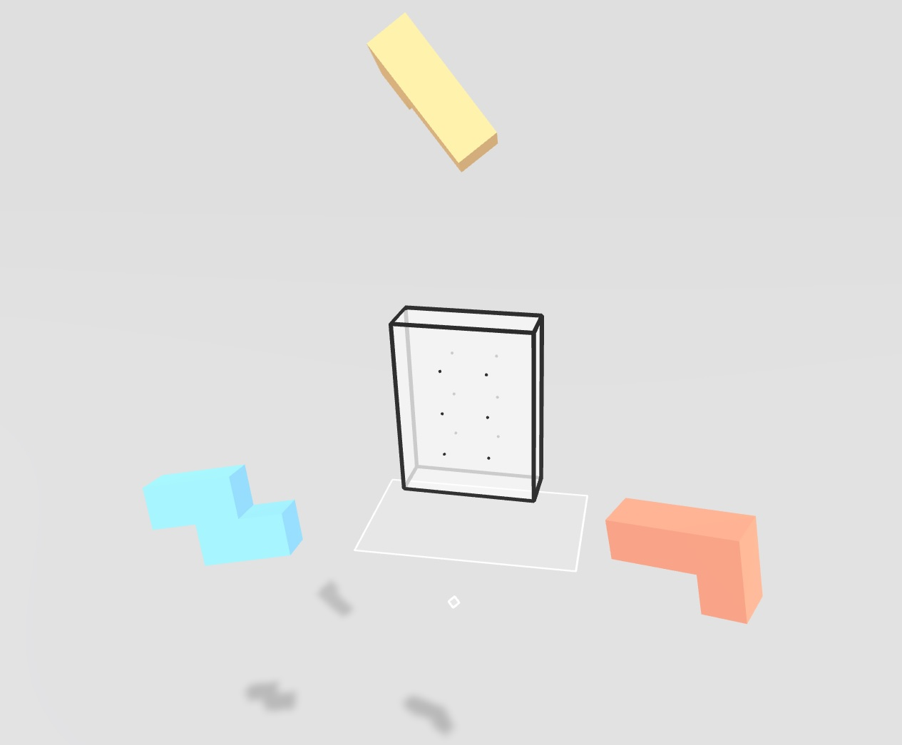

The first is by understanding VR's strengths, and keeping the scale close and tight. This allows motion parallax, stereoscopy, and perspective changes from head movement to be the primary indicator of depth.

Significantly, the game includes a **ground plane**. Implied merely through the blocks shadows from some distant light source, this extremely minimal ground plane and shadow information does a remarkably impressive job providing a *sense* of spatial understanding. Frankly, it probably does more in providing comfort than actual depth cues, but that comfort is important.

The game also provides minor extra perspective information: grid-dots on the shape and a transparent reference plane below it. The cubes that we manipulate are lit brightly, with shadow information that is telling of their orientation and shape. When we select an object, our hand-pointers intersect and become partially occluded (and the object is outlined).

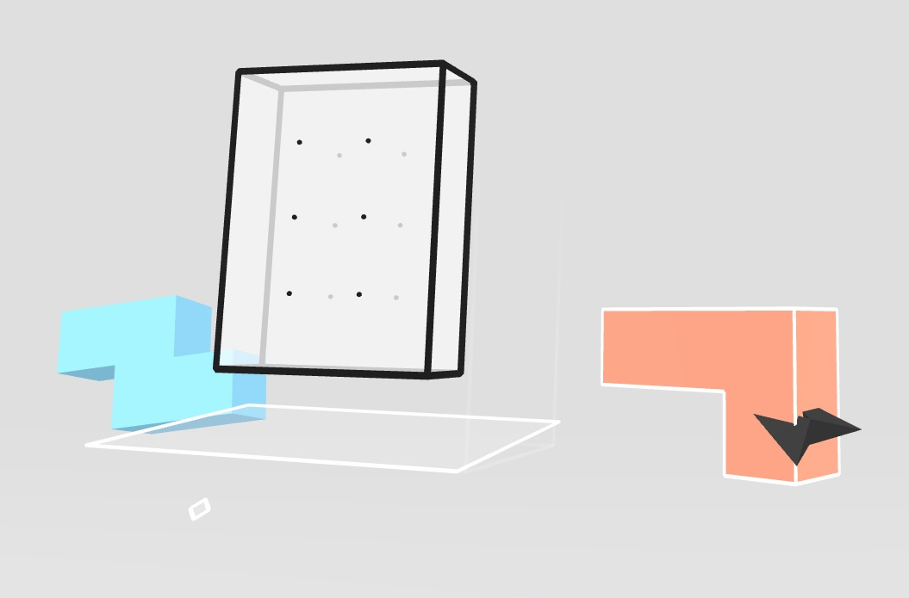
*The cursor becomes partially occluded by the block when it is intersecting it.*

This approach is still lacking in a number of ways. There is just so *little* to work with. Notably, the interactions are challenging by being all within arms reach, and it can be annoying to twist one's hand about to re-orient shapes. Spatially, I would have liked to see the grid-dots extend (faded, perhaps) outside of the shape and towards our periphery. Lastly, and potentially harming the aggressively minimal aesthetic, one could place couch-sized blocks on the ground in the distance to provide a stable reference for orientation and scale. (I would experiment with piling up completed levels to also give a sense of accomplishment and progress).

> *Ed note: The demo is free on [steam](https://store.steampowered.com/app/804530/Cubism/) right now. What do you think?*

### Animal Crossing: New Horizons

The game *Animal Crossing: New Horizons* appears to use an [orthographic](PerspectiveDistortionAndProjections.md) camera - avoiding linear perspective. No matter how far away things are, they should appear the same size. But they don't, the illusion of a 3 dimensional space is so convincing, it's hard to register the environment as "orthographic".

As objects get further from the camera, the game bends them towards the horizon, and adds a fairly significant atmospheric gradation, and background blur. Objects will also rotate (with the ground) affecting the visibility of their various sides, depending on how far away they are. 

<iframe width="560" height="315" src="https://www.youtube.com/embed/_3YNL0OWio0" frameborder="0" allow="accelerometer; autoplay; encrypted-media; gyroscope; picture-in-picture" allowfullscreen></iframe>

### Tilt-Shift Photography
Tilt term for use of a lens that is able to rotate the focal plane by rotating either the lens or the image sensor. Shift offsets the center of the lens from the center of the image sensor and can "skew" perspective. These are called camera lens **movements**, particularly in the context of large-format photography. Most generally, it is referred to as "tilt-shift" photography. 

Tilt-shift lenses were designed to *reduce* optical and perspective distortion, but it did not take long for photographers to figure out they could manipulate the effects.

Consider this image of [Edinburgh by Scotty Becca](https://scottybecca.wordpress.com/2011/01/26/edinburgh-in-miniature/).
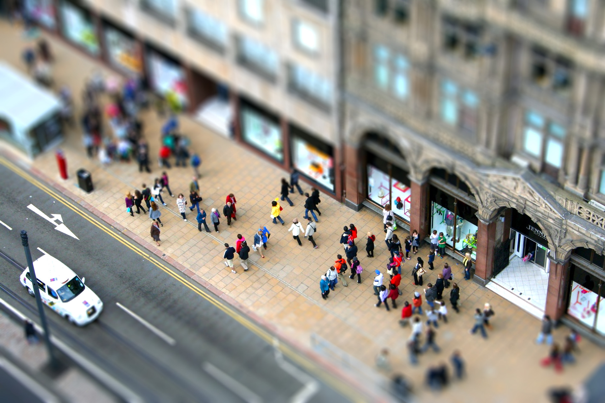

How big are those people? They look miniature! Is this a toy set?

Tilt-shift effects like this do a number of things to manipulate our ability to perceive space. Most significantly, the focal plan is tilted. Our brain expects things that are out of focus to be further away, in uniform with the degree of blur. The tilted focal plan distorts this expectation. We can make sense of it, however. This type of blur would be apparent if the subjects were miniature, and we were very close to them. (out of focus blur increases as focal distance decreases). So the blur gives the impression of a very close focal distance.

The "shift" part of tilt shift can also come into play, offsetting linear perspective cues, and causing lines that would approach a vanishing point quickly to approach it much slower.

But tilt-shift lenses do not always produce a miniature effect. The illusion only works if other conditions are met: Other depth cues need to be ignored. Most notably that's linear perspective - and perspective distortion.

The illusion that are most effective are almost always from a high vantage point looking down or out, and of distant subjects. This minimizes perspective distortion. As objects move about the frame, they don't get that much closer or further from the camera, and they don't change in size very much. Believable tilt-shift illusion photographs rarely have objects that are actually very close to the camera.

The effect can also be reinforced when combined with time-lapse or sped-up videography. Time-lapse makes large, slow-moving objects move and accelerate quickly, and already fast or erratic moving objects tend to zip around. More closely emulating the behavior we might expect from something miniature, acting more like a light plastic toy truck instead of the real thing. The entertaining short films of [Joerg Daiber](https://vimeo.com/spoonfilm) showcase this.

<iframe src="https://player.vimeo.com/video/384478574" width="640" height="360" frameborder="0" allow="autoplay; fullscreen" allowfullscreen></iframe>

<a href="https://vimeo.com/384478574">The Essence of Athens (4k - Time lapse -Tilt Shift)</a> from <a href="https://vimeo.com/spoonfilm">Joerg Daiber</a> on <a href="https://vimeo.com">Vimeo</a>.

## Interesting/Related
- Lightfield sensors are a different, interesting, approach to sensing light.
- [Accommodation-Convergence Reflex](https://en.wikipedia.org/wiki/Accommodation_reflex)
- [GDC Talk on The Art of Firewatch](https://www.youtube.com/watch?v=SdxQ3HlhTE8)
- Hitchcock Zoom
- [Motion-Induced Blindness](https://en.wikipedia.org/wiki/Motion-induced_blindness)
- [Ponzo Illusion](https://en.wikipedia.org/wiki/Ponzo_illusion)
- [Eppinghaus Illusion](https://en.wikipedia.org/wiki/Ebbinghaus_illusion)
- [Psychological influences on distance estimation in a virtual reality environment](https://www.frontiersin.org/articles/10.3389/fnhum.2013.00580/full)